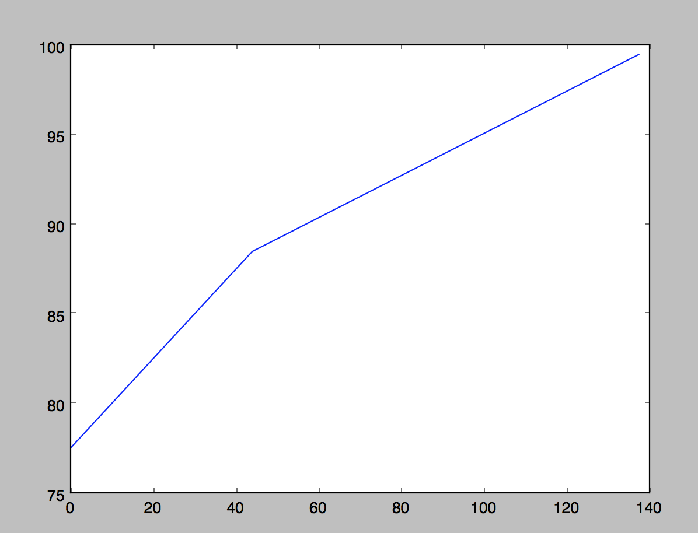

# Extract distances and properties over GeoJSON points

Input an iterable of GeoJSON points with Y-values as properties

Output two lists, xs and ys, suitable for plotting e.g. elevation profiles

**xs** list calculated from geodesic (Great circle) distance between points.

**ys** list taken directly from feature properties

Example:
```
from geodesicxy import profile

with open("points.geojson") as src:
    data = json.loads(src.read())
    features = data['features']

xs, ys = profile(features, "elevation")
print(xs)
print(ys)
```
which gives us

```
[0, 44.047093225698326, 137.53481892584122]  # X in miles by default
[77.5, 88.5, 99.5]
```

# Visualization

Easy to intergrate with matplotlib for visualization

    import matplotlib.pyplot as plt
    xs, ys = profile(features, "elev")
    plt.plot(xs, ys)
    plt.show()



# Getting Y properties for your points

Use [rasterstats](https://github.com/perrygeo/python-rasterstats)
to query for underlying raster values at existing points

    from raster_stats import point_query
    features_w_elev = point_query(
                        features,
                        "elev.tif",
                        property_name="elev",
                        geojson_out=True)
    xs, ys = profile(features_w_elev, "elev")

Or with the Mapbox Surface API via

    import mapbox
    res = mapbox.Surface().surface(features)
    features_w_elev = res.geojson()
    xs, ys = profile(features_w_elev, "elev")
